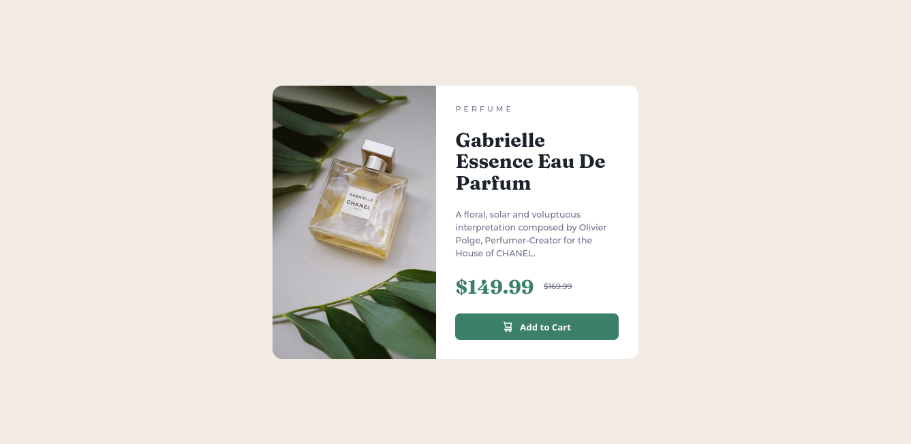
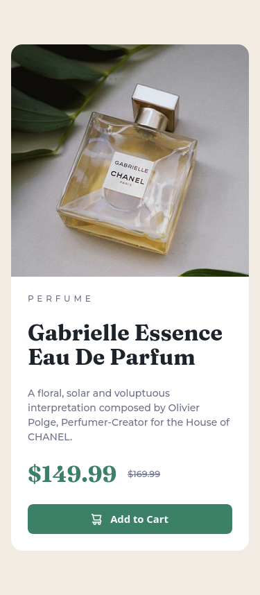

# Frontend Mentor - Product preview card component solution

This is a solution to the [Product preview card component challenge on Frontend Mentor](https://www.frontendmentor.io/challenges/product-preview-card-component-GO7UmttRfa). Frontend Mentor challenges help you improve your coding skills by building realistic projects.

## Table of contents

- [Overview](#overview)
  - [The challenge](#the-challenge)
  - [Screenshot](#screenshot)
  - [Links](#links)
- [My process](#my-process)
  - [Built with](#built-with)
  - [What I learned](#what-i-learned)
  - [Continued development](#continued-development)
  - [Useful resources](#useful-resources)
- [Author](#author)
- [Acknowledgments](#acknowledgments)

## Overview

### The challenge

Users should be able to:

- View the optimal layout depending on their device's screen size
- See hover and focus states for interactive elements

### Screenshot




### Links

- Solution URL: [Add solution URL here](https://github.com/Carlos-AAG/product-preview-card)
- Live Site URL: [Add live site URL here](https://carlos-aag.github.io/product-preview-card/)

## My process

I started by creating the HTML structure and then styling it with CSS, focusing first on the responsive model and finally the desktop model.
For this challenge, I designed using flexbox and grid.

### Built with

- Semantic HTML5 markup
- CSS custom properties
- Flexbox
- CSS Grid
- Mobile-first workflow

### What I learned

I focused on styling the button and icon in a different way than I already knew how, and the result

```html
<button class="button" data-icon="shopping-cart">Add to Cart</button>
```

```css
.button {
  cursor: pointer;
  display: inline-flex;
  justify-content: center;
  align-items: center;
  gap: 0.75rem;
  border: 0;
  border-radius: 0.5rem;
  padding: 0.75em 1.5em;
  background-color: var(--green-500);
  color: var(--white);
  font-weight: var(--fw-700);
  font-size: 0.925rem;
  width: 100%;
}

.button[data-icon="shopping-cart"]::before {
  content: "";
  background: url("images/icon-cart.svg") no-repeat center;
  background-size: contain;
  width: 15px;
  height: 16px;
}
.button:hover {
  background-color: var(--green-700);
}
```

## Author

- GitHub - [Carlos Alberto Aramayo G.](https://github.com/Carlos-AAG)
- Frontend Mentor - [@Carlos-AAG](https://www.frontendmentor.io/profile/Carlos-AAG)

**Note: Delete this note and add/remove/edit lines above based on what links you'd like to share.**
